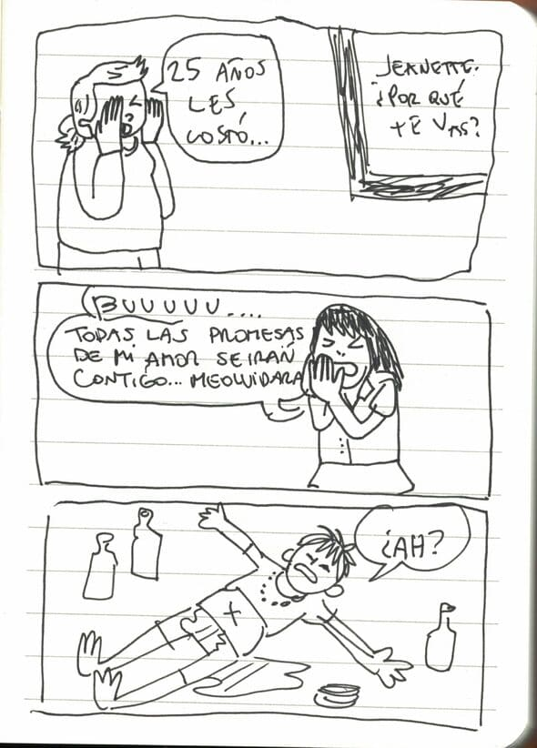
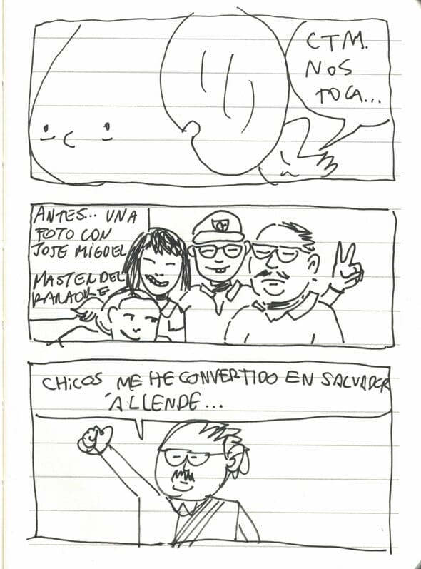
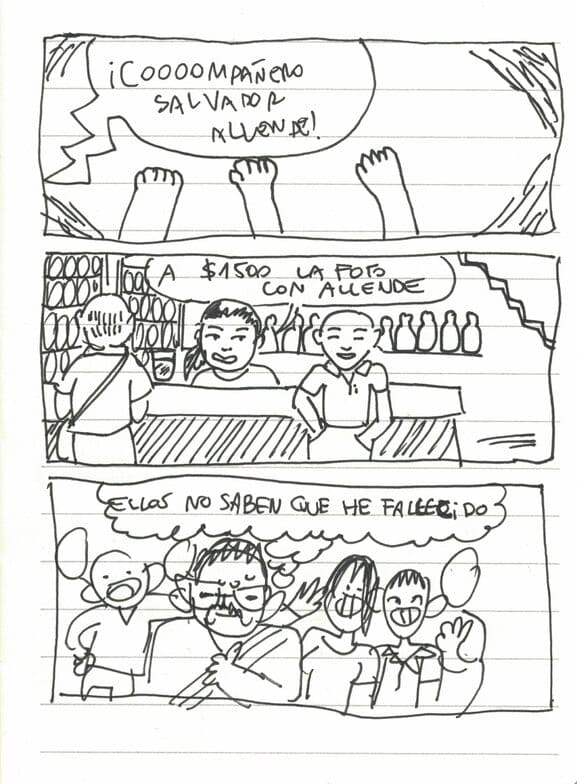
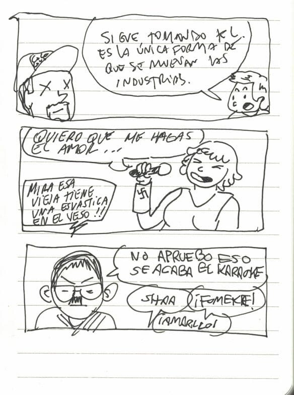

Lo que empezó como una inocente salida a ver a Deplasticoverde en el Museo Histórico, con Micetos y Cuchara, terminó en un karaoke, cantando con el mismísimo Salvador Allende, en el restorán "El rincón de arriba". Acá va el cómic que hicimos cuando íbamos como en la sexta Cristal de 1.2 litros.

  

  

  

  

  

Gracias por leer.

