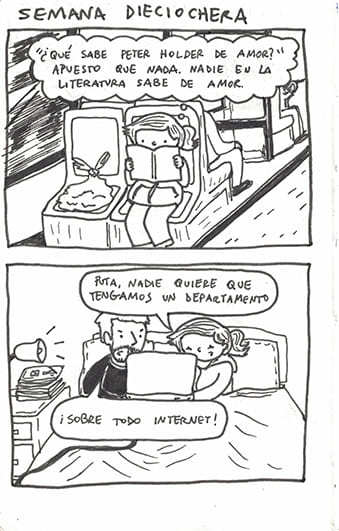
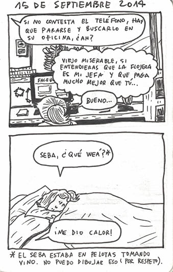
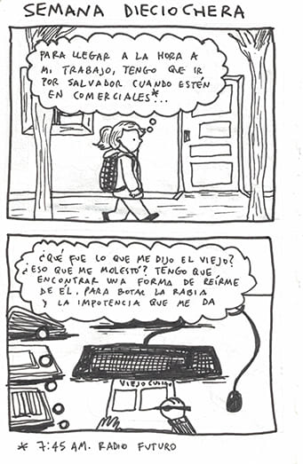
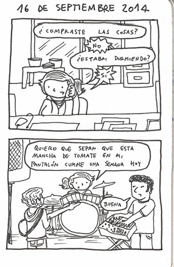

Encontré esta libretita botada. No tengo idea dónde estaba, pero estaba así: cochina, y tenía unos cuantos cómics e ideas de cómics anotados. Estas cuatro páginas de diario me pareció que valían la pena ser rescatadas. Las dejo aquí. No sé cómo despedirme. Chao. 

  

  

  

  

Gracias por leer.